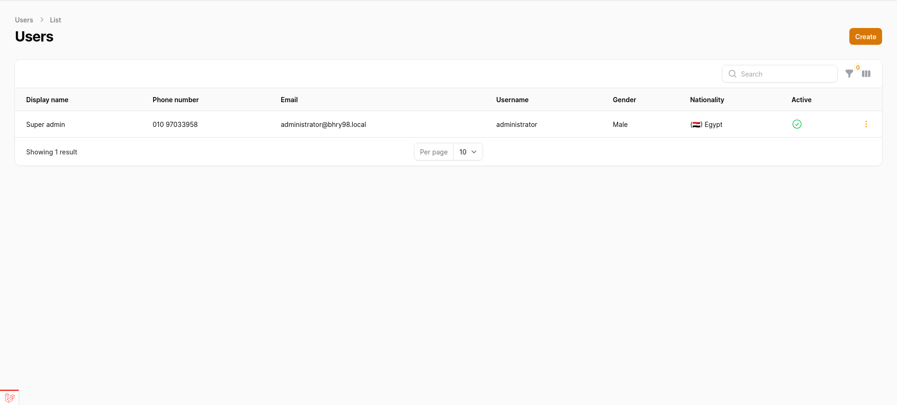

# 👤 CRUD Users

This section explains how to manage users using the Filament-powered CRUD interface.

---

## 🧾 All Users Table

View all users in a searchable, filterable, and paginated table.  
Includes soft-deleted users if trash is enabled.

📷 **Example: All Users Table**

---

## ➕ Create User (Slide Over)

Clicking **Create User** opens a slide-over form to quickly add a new user with roles and basic info.

📷 **Example: Create User Form**

---

## 🗑️ Delete User (Soft Delete)

When deleting a user, a confirmation modal ensures you want to **soft delete** the user.

📷 **Example: Delete User Confirmation**

---

## 🔄 Restore User

You can restore a soft-deleted user using the **restore** action in the table or detail page.

📷 **Example: Restore User Confirmation**

---

## ❌ Force Delete User

Force deleting permanently removes the user from the database.

📷 **Example: Force Delete Confirmation**

---

## 📧 Send Password Reset Mail

Admins can send a password reset link to any user directly from the interface.

📷 **Example: Send Password Reset Confirmation**

---

> 📝 **Tip:** All actions (delete, restore, force delete, reset password) use Filament's native modals for confirmation.

🔗 [← Back to Users Overview](overview.md)
